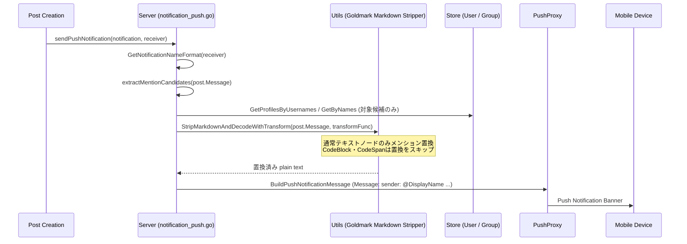

# モバイルプッシュ通知におけるメンション解決の実装計画

## 概要 (Goal Description)

Mattermost のモバイルプッシュ通知（PushProxy経由）において、投稿本文に含まれる `@username` メンションを、**受信者の表示名設定（`TeammateNameDisplay` / `name_format`）** に応じて `@表示名`（ニックネームまたはフルネーム）に置換して送信するサーバー側実装を行います。

### 背景と原則
1. **Webapp との非干渉**:
   - Webapp側の通知（PR #34063 / `upstream-34063`）はブラウザの Redux state / WebSocket 経由で受信した平文をクライアント側（`notification_actions.tsx`）で加工しています。
   - モバイル通知はサーバーから PushProxy を経由して端末に届くため、**サーバー側（`server/channels/app/notification_push.go`）でのプッシュペイロード生成時**に加工します。
   - DB に保存されている投稿生文（`post.Message`）や Webapp 向けの WebSocket イベントには一切干渉せず、プッシュ通知メッセージのみを変更します。

2. **PR #34063 でのコミッター（hmhealey氏）指摘事項の完全反映**:
   - **コードブロック・インラインコードの保護**: Markdown コードブロック（` ``` `）やインラインコード（` ` `）内の `@mention` は置換せず、元のまま保持する（Markdown stripping 処理と連動して実現）。
   - **末尾記号（`.`, `-`, `_`）の最長一致判定とサフィックス復元**: `@user.` のような文末メンションに対し、`user.` が存在するか `user` が存在するかを最長一致で判定し、余った末尾記号（サフィックス）を正確に復元する。
   - **特殊メンションの除外**: `@channel`, `@all`, `@here` は置換対象外とする。
   - **グループメンションの対応**: `allow_reference` が true のグループメンションを認識し、サフィックスを復元する。

---

## 全体アーキテクチャ



---

## ユーザー確認事項 (User Review Required)

> [!NOTE]
> **パフォーマンス配慮**: DB への問い合わせはメッセージ内に含まれるメンション候補（通常1〜3件）のみを対象に `GetProfilesByUsernames` および `GetByNames` を使用してバッチ取得します。全ユーザーのフェッチ等は行いません。また、本文に `@` が含まれない場合は即座に既存処理へフォールバックします。

> [!NOTE]
> **設定の反映タイミング**: プッシュ通知はサーバー送信時点での受信者の設定スナップショットに基づいて生成されます。これは現在の送信者名（`senderName`）の決定ロジック（`notification.go:GetSenderName`）と同一の挙動です。

---

## 変更対象ファイル (Proposed Changes)

対象ワークツリー: `/Users/toshino.naito/projects/upstream-issue-34066/` (ブランチ: `feature/mention-resolution-mobile-notification`)

### 1. Markdown ユーティリティ層 (`server/channels/utils/`)

#### [MODIFY] `server/channels/utils/markdown.go`
- `notificationRenderer` に `transformText func(string) string` フィールドを追加。
- `renderText`: `transformText` が設定されている場合、テキストノードの内容を `transformText` に通してから出力。
- `renderCodeSpan`: 新規登録し、子ノードの走査を行わずテキストを直接出力（`ast.WalkSkipChildren` を返却）することで、インラインコード内のメンション置換を防止。
- `StripMarkdownWithTransform(markdown string, transformText func(string) string) (string, error)` を追加。
- `StripMarkdownAndDecodeWithTransform(markdown string, transformText func(string) string) (string, error)` を追加（HTMLエンティティのデコードも実施）。
- 既存の `StripMarkdown` / `StripMarkdownAndDecode` は、`transformText = nil` で上記を呼び出すラッパーとして維持。

```go
// renderCodeSpan renders inline code without passing through transformText
func (r *notificationRenderer) renderCodeSpan(w util.BufWriter, source []byte, node ast.Node, entering bool) (ast.WalkStatus, error) {
	if entering {
		for c := node.FirstChild(); c != nil; c = c.NextSibling() {
			if textNode, ok := c.(*ast.Text); ok {
				_, _ = w.Write(textNode.Segment.Value(source))
			}
		}
	}
	return ast.WalkSkipChildren, nil
}
```

#### [MODIFY] `server/channels/utils/markdown_test.go`
- `StripMarkdownWithTransform` および `StripMarkdownAndDecodeWithTransform` の単体テストを追加。
  - 通常のテキストに対する置換テスト
  - コードブロック（``` ```）内で置換が**行われない**ことのテスト
  - インラインコード（` `）内で置換が**行われない**ことのテスト
  - HTMLエンティティデコードが正常に動作することのテスト

---

### 2. プッシュ通知・メンション解決層 (`server/channels/app/`)

#### [MODIFY] `server/channels/app/notification_push.go`
- `buildFullPushNotificationMessage` 内で、`postMessage` の生成を新設ヘルパー `resolveMentionsInPostMessage` 経由に置き換え。
- 新設関数:
  - `resolveMentionsInPostMessage(rctx request.CTX, post *model.Post, user *model.User) string`:
    1. `@` の存在チェック（含まれなければ通常の `StripMarkdownAndDecode`）
    2. 受信者の `nameFormat := a.GetNotificationNameFormat(user)` を取得
    3. `extractMentionCandidates(post.Message)` でメンション候補を抽出
    4. Store よりユーザー（`GetProfilesByUsernames`）およびグループ（`GetByNames`）を取得
    5. `StripMarkdownAndDecodeWithTransform` にメンション置換コールバックを渡して変換
  - `extractMentionCandidates(text string) []string`:
    - `(?i)(?:\B|\b_+)@([a-z0-9.\-_]+(?::[a-z0-9.\-_]+)?)` でマッチング
    - 各マッチに対し末尾の `.` / `-` / `_` を削った候補リストを生成（重複排除）
  - `replaceMentionsWithDisplayNames(text, nameFormat string, users map[string]*model.User, groups map[string]*model.Group) string`:
    - Webapp の `DisplayNameMentionRenderer` と同一のアルゴリズム
    - 特殊メンション除外（`all`, `channel`, `here`）
    - ユーザー最長一致（見つかれば `@DisplayName + suffix`）
    - グループ最長一致（`AllowReference` が true なら `@GroupName + suffix`）

```go
// buildFullPushNotificationMessage 内の差分イメージ:
-	postMessage := post.Message
-	stripped, err := utils.StripMarkdownAndDecode(postMessage)
-	if err != nil {
-		rctx.Logger().Warn("Failed to strip markdown from post", mlog.String("post_id", post.Id), mlog.Err(err))
-	} else {
-		postMessage = stripped
-	}
+	postMessage := a.resolveMentionsInPostMessage(rctx, post, user)
```

#### [MODIFY] `server/channels/app/notification_push_test.go`
- プッシュ通知メッセージのメンション解決に関する包括的なテストを追加：
  - `nameFormat = ShowNicknameFullName`: ニックネームがある場合はニックネーム、ない場合はフルネーム、それ以外はユーザー名
  - `nameFormat = ShowFullName`: フルネーム、未設定時はユーザー名
  - `nameFormat = ShowUsername`: 常にユーザー名
  - 末尾記号付き（`@user.` → `@Nickname.`）のサフィックス復元
  - ユーザー名自体に記号を含む場合（`user.` というユーザーが存在する場合）の最長一致
  - コードブロック・インラインコード内のメンションが置換されないこと
  - 特殊メンション（`@channel`, `@all`, `@here`）が置換されないこと
  - グループメンションのサフィックス復元および `allow_reference=false` 時の挙動
  - 存在しないユーザー名がそのまま保持されること

---

## 検証計画 (Verification Plan)

### 自動テスト (Automated Tests)
1. **Markdown Stripper テスト**:
   ```bash
   cd /Users/toshino.naito/projects/upstream-issue-34066/server
   go test -v -run "TestStripMarkdown" ./channels/utils
   ```
2. **プッシュ通知メンション解決テスト**:
   ```bash
   cd /Users/toshino.naito/projects/upstream-issue-34066/server
   go test -v -run "TestBuildPushNotificationMessage.*Mention" ./channels/app
   ```
3. **既存プッシュ通知テストの全件パス確認**:
   ```bash
   cd /Users/toshino.naito/projects/upstream-issue-34066/server
   go test -v -run "TestBuildPushNotificationMessage" ./channels/app
   ```

### 手動確認・仕様突合 (Manual Verification)
- Webapp側（`upstream-34063`）のテストケース（21件のメンションバリエーション）と、今回追加するサーバー側テストケースの入力・期待値が完全に一致していることを確認する。
